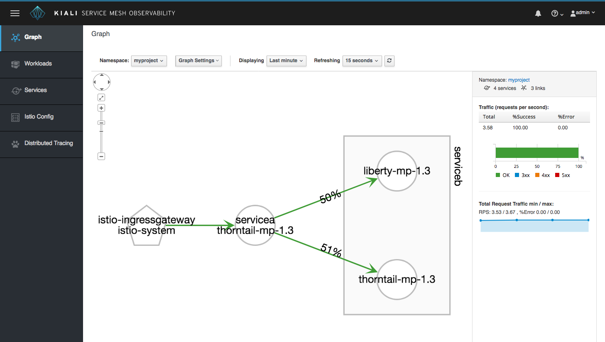

## MicroProfile Istio Sample
This sample is intended to show the interaction between Istio and the various MicroProfile specifications.

### Requirements
* [Git](https://git-scm.com/)
* [Docker](https://www.docker.com/)
* [Maven](https://maven.apache.org/install.html)
* [Java 8]: Any compliant JDK should work.
* [kubectl](https://kubernetes.io/docs/tasks/tools/install-kubectl/)
    * If your cluster is [minikube](https://kubernetes.io/docs/getting-started-guides/minikube/), you will already have this
* [Istio](https://istio.io)
    * The sample is currently based on the preliminary release of Istio 1.0.

### Contents
Various configuration files to deploy the service mesh sample services to Istio on Kubernetes. 

serviceA is currently the entry point for the sample. Once deployed, the sample can be accessed at:
```
http://<your kubernetes cluster>/mp-servicemesh-sample/serviceA
```
### Deployment Process

The steps involved in building the project are:
1.  [Build the services](#build)
2.  [Push the images to a repository](#push)
3.  [Deploy the sample to your cluster](#deploy)

### Build

Each service resides in its own repository. Follow the instructions in the READMEs there to build the sample services and package them as docker images.
* [serviceA](https://github.com/eclipse/microprofile-service-mesh-service-a)
* [serviceB](https://github.com/eclipse/microprofile-service-mesh-service-b)

### Push

If you followed the image naming suggestion from the individual service READMEs, you will have at least 2 images to 
push named something like &lt;docker id&gt;/servicea-&lt;profile&gt;:<tag> and &lt;docker id&gt;/serviceb-&lt;profile&gt;:<tag>.
Assuming you're going to use docker hub as your repository, login there and push your images.

### Deploy

You need to create deployment yaml for each service image you built, preprocess
it using istioctl and then apply the resulting yaml with kubectl.
If you followed the suggested naming convention for your service images, you can use the supplied script.
Make sure you can access you cluster with kubectl and that Istio is installed. Use the following command to deploy your images:
```
awk -f make-deployments.awk | istioctl kube-inject -f - | kubectl apply -f -
```
If you have named your images in some other way, create deployment yaml for each of your images using the supplied deployment-template.yaml as a guide. Then apply your resulting yaml as follows:
```
istioctl kube-inject -f <your deployment yaml> | kubectl apply -f -
```
Finally, deploy the remaining yaml with the following commands:
```
kubectl apply -f services.yaml
istioctl create -f gateway.yaml
```

### Run the Sample

You now have the sample installed in your cluster. The entrypoint for the sample is:
```
http://<your kubernetes cluster>/mp-servicemesh-sample/serviceA
```

Or by using the Istio-Ingressgateway (exposed by an OpenShift route):

```
http://istio-ingressgateway-istio-system.172.31.7.9.nip.io/mp-servicemesh-sample/serviceA
```


The result should look something like:
```
{"time":1532422406926,"source":"org.eclipse.microprofile.servicemesh.servicea.ServiceA$Proxy$_$$_WeldSubclass@9acb4f34","message":"Hello from serviceA","data":{"time":1532422406926,"message":"Hello from serviceB (org.eclipse.microprofile.servicemesh.serviceb.ServiceBEndpoint$Proxy$_$$_WeldSubclass@6d4029a5) at Tue Jul 24 08:53:26 UTC 2018 on serviceb-deployment-5d999b479b-t27g4 (ServiceB call count: 4, failFrequency: 10)","callCount":0,"tries":0,"fallback":false},"callCount":4,"tries":1,"fallback":false}
```
or
```
{"time":1532423342925,"source":"org.eclipse.microprofile.servicemesh.servicea.ServiceA$Proxy$_$$_WeldSubclass@58b97ce0","message":"ServiceA fallback. ServiceB could not be reached at: http://serviceb-zervice:8080/mp-servicemesh-sample","callCount":0,"tries":3,"fallback":true}
```
This shows that serviceA is working and has tried to communicate with serviceB.
Sometimes this falls back depending on the current code in serviceB and whether Istio traffic management has already been applied.




### Inject Faults to Provoke Fault Tolerance Behavior

ServiceB can be configured to succeed only every nth time it's called - where n is the failFrequency property in the serviceB configmap.

Delays and faults can be injected into the service calls to test the fault tolerant behavior of the application.
A sample Istio virtual service configuration file is provided which will cause 25% of calls to serviceB to fail.
The sample virtual service can be installed with this command

    kubectl create -f fault-injection.yaml

and deleted with:

    kubectl delete -f fault-injection.yaml

You can experiment with the percentage to provoke different fault tolerance behavior. For example, a percentage of 100 will cause the fallback method of serviceA to be invoked every time and the result will always be similar to:
```
{"time":1532423342925,"source":"org.eclipse.microprofile.servicemesh.servicea.ServiceA$Proxy$_$$_WeldSubclass@58b97ce0","message":"ServiceA fallback. ServiceB could not be reached at: http://serviceb-zervice:8080/mp-servicemesh-sample","callCount":0,"tries":3,"fallback":true}
```
The percentage can be modified by editing fault-injection.yaml and re-running the kubectl command above to update the virtual service.
